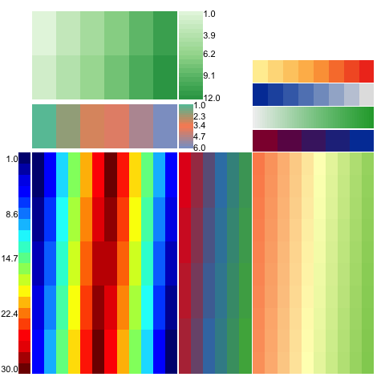
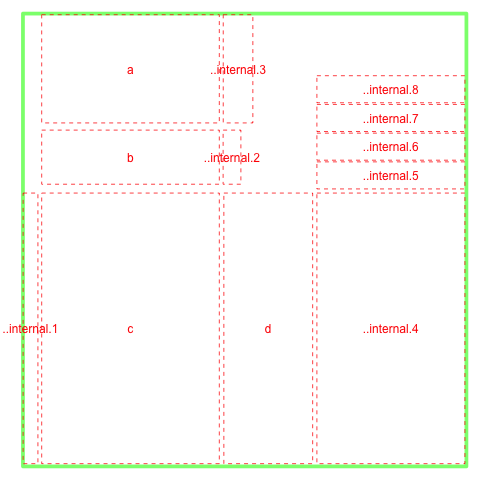

# WHeatmap [](https://travis-ci.org/zwdzwd/wheatmap)

WHeatmap designs a set of languages and a layer system that allows arbitrary positioning of heatmaps programmatically.

It makes plotting complex heatmaps using plain English such as **TopOf**, **RightOf** and **BottomLeftOf** etc.

To install from github using devtools,
```R
library(devtools)
install_github('zwdzwd/wheatmap')

library(wheatmap)
```

For example, the following complex layout

 

can be generated simply by

```R
WHeatmap(matrix(1:12,nrow=2), cmp=CMPar(brewer.name='Greens'), name='a') + 
  WHeatmap(matrix(1:6,nrow=1), Beneath(pad=0.05), cmp=CMPar(brewer.name='Set2'), name='b') +
  WHeatmap(matrix(c(1:30,30:1),nrow=5), Beneath(pad=0.05), 'c', cmp=CMPar(cmap='jet')) +
  WHeatmap(matrix(1:24,nrow=4), RightOf('c'), 'd', cmp=CMPar(brewer.name='Set1')) +
  WLegendV('c', LeftOf('c', pad=0.01), yticklabel.side='l') +
  WLegendV('b', RightOf('b', width=0.1)) + 
  WLegendV('a', RightOf('a')) + 
  WHeatmap(matrix(1:100, nrow=10), RightOf('d'), cmp=CMPar(brewer.name='RdYlGn')) +
  WColorBarH(matrix(5:1), TopOf(), cmp=CMPar(colorspace.name = 'diverge_hcl')) +
  WColorBarH(matrix(50:1), TopOf(), cmp=CMPar(colorspace.name = 'terrain_hcl')) +
  WColorBarH(matrix(1:8), TopOf(), cmp=CMPar(colorspace.name = 'sequential_hcl')) +
  WColorBarH(matrix(1:8), TopOf(), cmp=CMPar(brewer.name = 'YlOrRd'))
```

One who is really obssessed with `%>%` can do something like
```R
library(magrittr)
WHeatmap(cc$mat, name='h1') %>% add(WColorBarV(row.data, LeftOf('h1'), 'c1'))
```

The layout looks like



In order to cross-refer panels in the plot, one has to use a unique name. This name can be given through the `name=` option and user has to make sure the uniqueness of the names from existing objects in the plot. If not specified, wheatmap can generate a unique name and that name is visible from `ly()` function. A special `NULL` tag can be used to refer to the last plotted object.

More User guides:

 + [Tutorial](http://zwdzwd.github.io/wheatmap/tutorial.html)
 + [Legend Guide](http://zwdzwd.github.io/wheatmap/legend.html)

## Acknowledgement

- The internal `grid.dendrogram()` function is adapted from `ComplexHeatmap` package.
